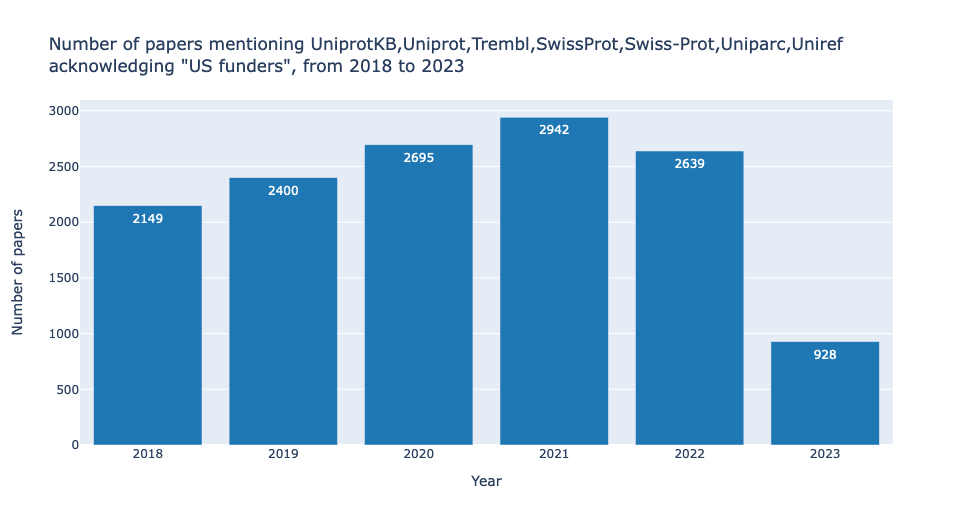

# MBDBMetrics
MBDBMetrics: An online metrics tool to measure the impact of biological data resources

## Molecular Biology Database Metrics Jupyter Notebook
At [UniProt](https://uniprot.org) we have developed some useful metrics over the years to measure and report our progress and impact to funders and policy makers. As part of an administrative supplement awarded by NIH [ODSS](https://datascience.nih.gov/about/odss) we have created this Google Colab page to enable other data resource providers to easily run these metrics.

This page allows you to investigate how often a resource is mentioned in the full text literature and how often it is mentioned in papers that cite specific funding sources. You need not limit yourself to only looking at database resources. You can use any keywords to investigate the impact of experimental techniques or anything else you can think of.

If you have specific feedback on this notebook then please contact Alex Bateman (<agb@ebi.ac.uk>).
We would like to thank the fantastic work of [Europe PubMed Central](https://europepmc.org/) and [ChEMBL](https://www.ebi.ac.uk/chembl/) for making the APIs that power much of this page.


## Contents

This notebook will perform queries in publication ([EuropePMC](https://europepmc.org/)) and patents ([SureCHEMBL](https://www.surechembl.org/)) databases to compute and display graphically the impact of a resource.
In particular plots will be generated that
- show how the number of mentions changes over time
- group publications by the grant agency they acknowledge
- find in which section of a publication a resource is mentioned.

# Installation

Clone this repository or simply download the [MBDBMetrics jupyter notebook](./UniProt_MBDBMetrics.ipynb) and run it in your jupyter server. The file [requirements.txt](./requirements.txt) lists the libraries that need to be installed (i.e. ipywidgets, pandas, plotly, requests, tqdm).

# Instructions

Start by executing BOTH the (⏵︎) **Code** and the **Parameters** cells (wherein you can specify what to query for).

After doing that, to (re)generate the plots, execute (⏵︎) the corresponding cells.
Alternatively, after choosing what to query in the **Parameters** section, you can choose **Run all** from the **Runtime** menu at the top of the page.

If this is your first time using an interactive notebook or colab, you may want to check the [intro to jupyter notebooks](https://jupyter.org/try-jupyter/retro/notebooks/?path=notebooks/Intro.ipynb) or the [colab introductory page](https://colab.research.google.com/)

### Changelog:

    2023.03.12 first colab version with basic query capabilities
    2023.03.13 added plot generation via plotly and parameters selection via form
    2023.03.14 interface and plot improvements; added capability to download data as csv, introduction text and first tests of patent info retrieval
    2023.03.15 improved plot interface, also with possibility to draw on plots; plots can be saved with meaningful filenames; added retrieval of patent information from SureChEMBL
    2023.03.16 added retrieval of total patents in timeframe; added progress bars and error messages if Code has not been initialised
    2023.06.27 changed to ascii progress bar to avoid incompatibility with plotly display
    2023.08.25 converted from colab version to run independently as jupyter notebook

### Link to Google Colab version

The notebook was originally published as a [colab](https://colab.research.google.com/drive/1aEmSQR9DGQIZmHAIuQV9mLv7Mw9Ppkin)

### Credits:

Code by Alex Bateman, Alex Ignatchenko and Giuseppe Insana

© 2023- [UniProt consortium](https://www.uniprot.org/help/about)

### Sample plots

The current version of MDBDMetrics generates the following plots:
- Total results (number of papers and number of patents mentioning the specified resource, in the specified time frame and/or acknowledging a certain funding agency). This graph gives an overview of the major metrics calculated by this tool.


- Publication mentions by year (number of papers mentioning the resource for each year in the specified range, with or without acknowledging a specified funding agency).



- Publication mentions by grant agency (a total of 28 funding agencies are currently defined but, again, it is easy to modify the code to change or extend this set). This plot enables an understanding of the relative use of a resource by fundees of different agencies.


- Publication mentions by paper section (18 paper sections are defined).  This graph can be useful to highlight for example whether a resource is mostly mentioned in the Methods rather than in the Discussion or in the Abstract of publications.


- Patent mentions by year (number of patents mentioning the specified resource in the specified time frame). This graph can help to understand how a resource is used in records of new inventions and give a glimpse of industrial use.


### Tips

- Add your own query search terms: simply modify the `options` array in the `query_widget = widgets.Dropdown` definition.
- Add more funding agencies: simply modify the `options` array in the `granters_widget = widgets.Dropdown` definition.
- Export all generated plots as svg (Scalable Vector Graphics format): look for `plotly_config` at the beginning of the Code cell and three lines below that change from `'format': 'png'` to `'format': 'svg'`. Once that is done and the cell re-run, the *Download plots as* button in the plot interface (the camera icon) will allow to export the plots in svg format.

### Citation

If you find this software useful, please consider citing the [journal article](https://doi.org/10.1093/bioadv/vbad180) ([pubmed 38130879](https://pubmed.ncbi.nlm.nih.gov/38130879)):

Bibtex:
```
@article{10.1093/bioadv/vbad180,
    author = {Insana, Giuseppe and Ignatchenko, Alex and Martin, Maria and Bateman, Alex and UniProt Consortium },
    title = "{MBDBMetrics: an online metrics tool to measure the impact of biological data resources}",
    journal = {Bioinformatics Advances},
    volume = {3},
    number = {1},
    pages = {vbad180},
    year = {2023},
    month = {12},
    issn = {2635-0041},
    doi = {10.1093/bioadv/vbad180},
    url = {https://doi.org/10.1093/bioadv/vbad180},
    eprint = {https://academic.oup.com/bioinformaticsadvances/article-pdf/3/1/vbad180/54717401/vbad180.pdf},
}
```
